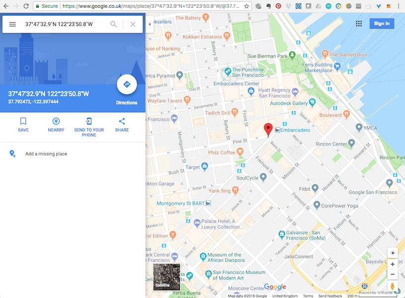
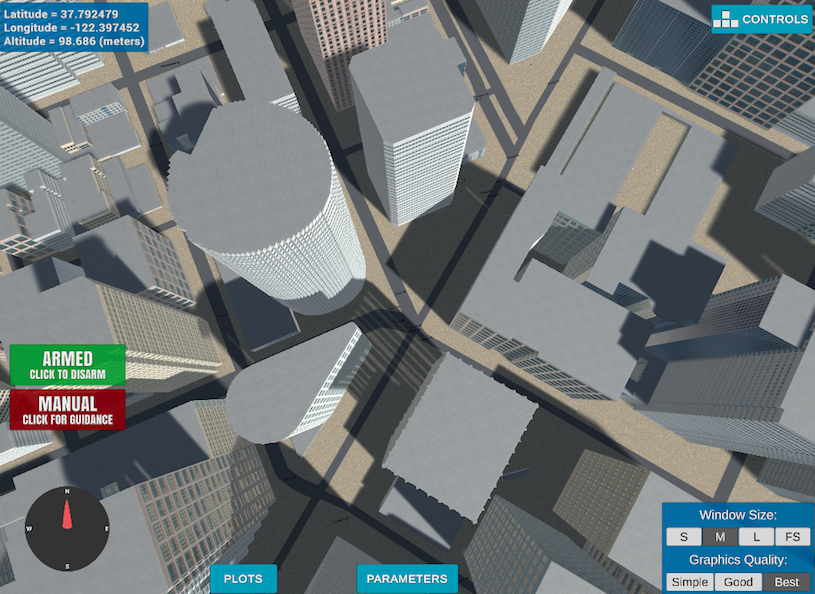
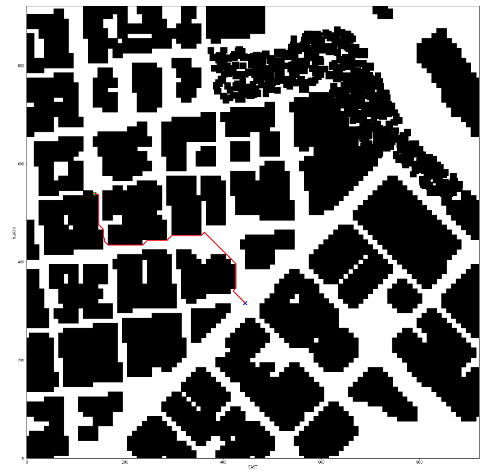
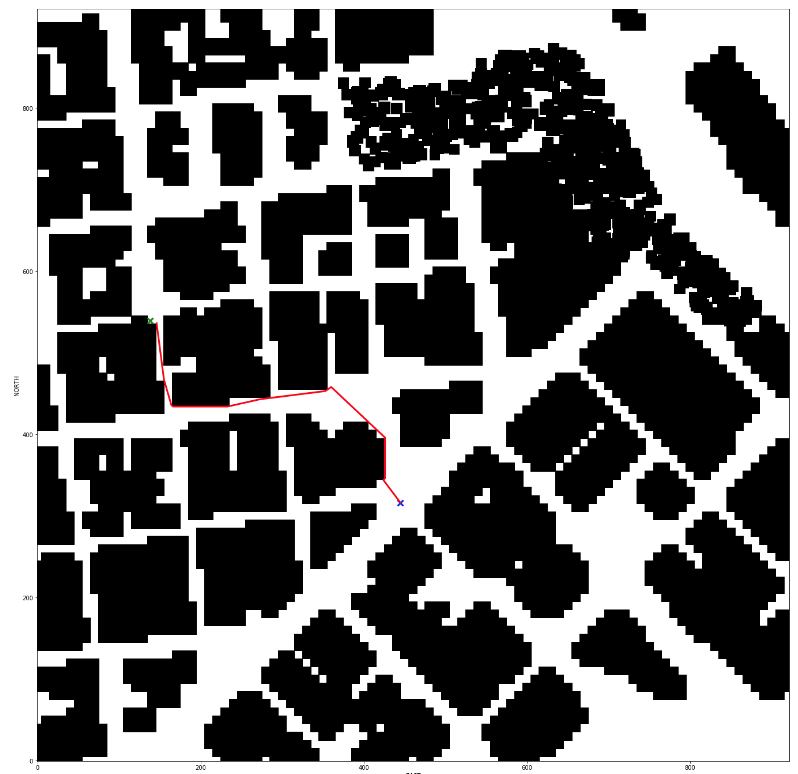
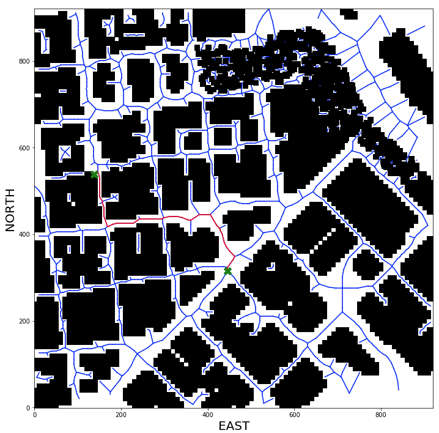

# Project Write-up: 3D Motion Planning

---
#### 1. Provide a Writeup / README that includes all the rubric points and how you addressed each one.  You can submit your writeup as markdown or pdf.

You're reading it!
Here I will consider the [rubric](https://review.udacity.com/#!/rubrics/1534/view)
points individually and describe how I addressed each point in my implementation.

### Explain the Starter Code

#### 1. Explain the functionality of what's provided in `motion_planning.py` and `planning_utils.py`

These scripts contain a basic planning implementation that includes the class `MotionPlanning`, subclass of `Drone` (defined in `udacidrone`.)
`MotionPlanning` provides basic code to connect to the drone, arm, takeoff, plan a path, follow the planned path to the goal, land, disarm.
`planning_utils.py` provides useful starting code to create a grid from map representation and plan path in a grid using A* algorithm and a
user-defined heuristic function.

`MotionPlanning` class is different from `BackyardFlyer` that we have seen before in a number of ways:

- it has a new `State` defined called `PLANNING`
- `PLANNING` is envoked once `ARMING` is complete
- once `PLANNING` finishes the drone is transitioned to `TAKEOFF`
- to implement `PLANNING` a function called `plan_path` is defined
- inside `plan_path` the following has to happen
    * set target altitude
    * read home position from config file and set it on the drone
    * get current global position
    * convert to local position using `global_to_local()`
    * read map and convert it to grid representation
    * find start position in the grid
    * set goal position in the grid
    * run A* to find a path in the grid
    * prune the path
    * convert path to waypoints
    * send waypoints to simulator (for visualisation)

The provided `colliders.csv` file represents a map of area
around central San-Francisco with obstacle positions given in relation
to global position specified in the first line of 
the file `lat0 37.792480, lon0 -122.397450`:



The remaining lines in `colliders.csv` represent center points of obstacles 
along with their dimensions in 3D:

```
posX,posY,posZ,halfSizeX,halfSizeY,halfSizeZ
-310.2389,-439.2315,85.5,5,5,85.5
-300.2389,-439.2315,85.5,5,5,85.5
...
```

Here's what same area looks like in the simulator:




### Implementing Path Planning Algorithm

#### 1. Set global home position

We set global home position to the center of the map, as specified in `colliders.csv`

```python
        filename = 'colliders.csv'
        with open(filename) as f:
            for line in f:
                break
        (_, lat0, _, lon0) = line.split()
        lat0 = float(lat0.strip(','))
        lon0 = float(lon0.strip(','))

        # set home position to center of the map
        self.set_home_position(lon0, lat0, 0)
```

This obviously means that the drone better be around that position,
either in the simulation or in the real world.
Because the map only covers certain area around this position.
If the actual drone is started in Easter Island it will have real trouble
planning a path as the map does not go there.
In our case simulator initialises the drone in pretty much the position we set as home.


#### 2. Set your current local position

Having defined global home we can operate in the NED frame centered at the home position.
`global_to_local` function from `frame_utils.py` can convert between global and NED frames.

Under the hood `global_to_local()` uses python `utm` package (Bidirectional UTM-WGS84 converter,
UTM being [Universal Transverse Mercator](https://en.wikipedia.org/wiki/Universal_Transverse_Mercator_coordinate_system)).
It is instructive to see how this is done:

```python
def global_to_local(global_position, global_home):
    """
    Convert a global position (lon, lat, up) to a local position (north, east, down) relative to the home position.

    Returns:
        numpy array of the local position [north, east, down]
    """
    (east_home, north_home, _, _) = utm.from_latlon(global_home[1], global_home[0])
    (east, north, _, _) = utm.from_latlon(global_position[1], global_position[0])

    local_position = np.array([north - north_home, east - east_home, -global_position[2]])
    return local_position
```

And we use this as follows:

```python
        # retrieve current global position of the Drone. (lon, lat, alt) as np.array
        # convert current global coordinates to NED frame (centered at home)
        l_pos = global_to_local(self.global_position, self.global_home)
```


#### 3. Set grid start position from local position

We use 3D grid map representation where each grid 
cell is either occupied or free.
We also navigate from a cell to a cell of that grid.
So in this step we need to convert our NED coordinates (which are in meters)
to grid indices of the cell we are in.

As the grid cell size is defined to be 1 meter (we 
defined this in `create_grid` function)
the translation is straightforward - just round NED 
coordinates to the nearest integer.

```python
        def local_to_grid(l_pos, north_offset, east_offset):
            def int_round(i):
                return int(round(i))
            return (-north_offset + int_round(l_pos[0]), -east_offset + int_round(l_pos[1]))

        grid_start = local_to_grid(l_pos, north_offset, east_offset)
```

#### 4. Set grid goal position from geodetic coords

```python
        l_goal = global_to_local(g_goal, self.global_home)
        grid_goal = local_to_grid(l_goal, north_offset, east_offset)
```


#### 5. Modify A* to include diagonal motion (or replace A* altogether)

At first I have modified `A* on the grid` implementation provided in lectures
by implementing extra `Actions` to move north-east, north-west,
south-west, south-east with cost of `sqrt(2)`.
Using collinearity check the path is down from 451 waypoints to just 22.
Here is what the pruned path looked:



Immediately I noticed that the time taken to plan such a path was 7.98 seconds.
So I started to tune the algorithm.
I have profiled `a_star` code using [`cprofilev`](https://github.com/ymichael/cprofilev), an easy python profiling tool.
It turned out that heuristic function was taking most of the time.
`np.linalg.norm` was the culprit, so I replaced it with `sqrt(x**2+y**2)`, which cut the time to 3.38 secs.
The next biggest time consumer is get property `delta` on `Action`.
Replacing it with 2 simple functions to get first and second elements cuts time to 2.98 secs.
Changing `Action.cost` from being a property to simple function cuts time further to 2.9 sec.
The resulting code is less generic and specific to 2D planning, but the performance improvements are well worth it!
Unfortunately with grid based approach to planning there are a lot of computations to perform, so I have left it there.

Then I replaced collinearity pruning by Bresenham ray tracing algorithm
to prune not just straigh line path segments, but segments that
can 'short-cut' parts of the path using straight line free-space segments.
The path looked much better, without any performance issues:



The path looks 'smoother' than simple collinearity pruning, but does go very close to the buildings.

So next I tried a grid/graph hybrid approach.
I used grid to Voronoi graph transformation shown in the lectures, using center
points of the obstacles as seeds for Voronoi space segmentation. With subsequent ray-tracing tests to prune
resulting Voronoi ridges that collide with obstacles.
The current map representation generates ~9700 Voronoi ridges that need to be mutually tested by Bresenham if they
can connect through the free space. Only ~1400 ridges satisfy this condition. 
But because of this step the planning
takes a lot longer than simple A* on grid -- 22 seconds.

The resulting path is much safer as it clears obstacles by a wide margin:




#### 6. Cull waypoints 

See above. I tried both collinearity and ray-tracing for grid-based A* search.
And collinearity for A* on graph. It does result in small reduction of graph-based path length.


### Execute the flight
#### 1. Does it work?

The flight works beautifully.
But with distance-based waypoints the drone movement along the path is jerky.
I have improved here by making 'deadband' around waypoint a function of time and speed,
see below.


### Double check that you've met specifications for each of the [rubric](https://review.udacity.com/#!/rubrics/1534/view) points.
  
# Extra Challenges: Real World Planning

For an extra challenge, consider implementing some of the techniques described in the "Real World Planning" lesson.
You could try implementing a vehicle model to take dynamic constraints into account, or implement a
replanning method to invoke if you get off course or encounter unexpected obstacles.

### Time-based Deadbands

I have improved progress on the path
by using the approach of 'if we are within 1 second of getting to currently
targeted waypoint, switch to the next one':

```python
    def local_position_callback(self):
        if self.flight_state == States.TAKEOFF:
            if -1.0 * self.local_position[2] > 0.95 * self.target_position[2]:
                self.waypoint_transition()
        elif self.flight_state == States.WAYPOINT:
            v = self.local_velocity
            v_norm = np.linalg.norm(v)
            tp = self.target_position[0:3]
            lp = self.local_position[0:3]
            lp[-1] = -lp[-1] # for some strange reason altitude here is not negative
            dist = np.linalg.norm(tp - lp)
            DEADBAND = v_norm * 1.0 # speed times time of 1 sec
            if DEADBAND < 1.0:
                DEADBAND = 1.0
            if dist < DEADBAND:
                if len(self.waypoints) > 0:
                    self.waypoint_transition()
                else:
                    if np.linalg.norm(self.local_velocity[0:2]) < 1.0:
                        self.landing_transition()
```

This results in much smoother movement of the drone along the path.
It is not following waypoints precisely, but given that our path planning
generated the path that is far away from the obstacles it is good enough 
approach to not crash
and still maintain good progress towards goal.

I have tested this with increased `max_speed` simulator parameter of *15 m/s*
and it still works great! For the target that I picked I can execute the planned
path in 71 seconds! That is for the path of 549 meters, so averaging 7.7 m/s.


### Probabilistic Roadmap

We have tried to adapt classrom implementation of 3D probabilistic roadmap.
It proved quite tricky.
The way our map is represented by about 4000 colliders does not work really well
with the proposed algorithm out of the box. It requires about 3000 samples
with number of neighbours of 5 to produce more or less connected graph in about 10 minutes
on a laptop.
This is much worse performance than that of Voronoi-based approach.
We have tried to improve performance by using `cprofilev`.
It is the testing whether a line between 2 points passes through polygon that
is taking all of the time. This operation is cheap with `shapely`, but it has to
happen for about 6 million times for our map representation and reasonable number of
samples. So it becomes the biggest time consumer.

As of now we have put this idea on hold, to be tackled when we know more about
better 3D map representations. In particular map representations that are optimised
for the intersection tests.


